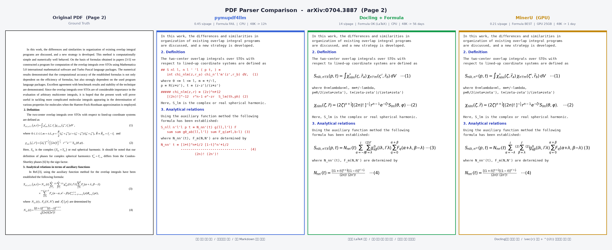

# paper-crawler

LLM 학습용 "현대 화학" 논문 데이터셋 구축 크롤러.
arXiv + Semantic Scholar에서 2000~2025년 화학 관련 논문을 수집하여 Parquet으로 저장합니다.

---

## 최종 결과 (2026-04-09)

| 단계 | 상태 | 결과 |
|------|------|------|
| ① arXiv 메타데이터 수집 | **완료** | 254,376건 (9개 카테고리, 2000~2025) |
| ② arXiv LaTeX/PDF 다운로드 | **완료** | 167,895건 LaTeX + 48,652건 PDF |
| ③-a LaTeX → plain text 클리닝 | **완료** | 잔존율 0.000% (Karpathy Loop 4회) |
| ③-b PDF 배치 파싱 (pymupdf4llm) | **완료** | 48,630건 성공 / 22건 실패 |
| ④ Semantic Scholar 보충 | **미시작** | API key 필요, 팀 합의 필요 |
| ⑤ 중복 제거 | **완료** | hash 30,140건 + fuzzy 중복 제거 |
| ⑥ DuckDB 인덱싱 | **완료** | SQL 쿼리 가능 (data/index.db) |
| ⑦ Eval 점수화 | **완료** | **96.8/100** |

### 본문 확보 현황

| source_type | 건수 | 설명 |
|-------------|------|------|
| `arxiv_latex` | 167,895 | LaTeX 원본 (최고 품질) |
| `arxiv_pdf_pymupdf4llm` | 54,728 | PDF → Markdown 파싱 완료 |
| `arxiv_pdf_saved` | 415 | PDF 파싱 실패 (손상 PDF) |
| `NULL` | 1,089 | abstract만 보유 |
| **합계** | **224,161** | **Full-text 확보율 99.3%** |

### Eval Score: 96.8/100

```
 Schema Completeness     10.0/10 (x15%)
 Full-text Coverage       8.8/10 (x20%)
 LaTeX Parse Quality     10.0/10 (x20%)
 Metadata Accuracy       10.0/10 (x10%)
 Dedup Effectiveness     10.0/10 (x10%)
 Language Purity         10.0/10 (x5%)
 Token Distribution       9.4/10 (x10%)
 Hash Uniqueness         10.0/10 (x10%)
```

---

## 전체 파이프라인 흐름

```
[입력]                    [크롤러가 하는 일]                       [출력]

arXiv 카테고리 목록  ──→  ① 메타데이터 수집 (API)  ─────────→  title, abstract, authors...
(config.py에 정의)                                               (.parquet 파일)
                         ② LaTeX 다운로드 (e-print) ─→  LaTeX 성공  → full_text (LaTeX 원본)
                                                   └→  LaTeX 실패  → PDF 파일 저장 (data/arxiv/pdfs/)
                          ↓ LaTeX 있는 논문
                         ③-a LaTeX 클리닝 (즉시)   ──────────→  clean_text (plain text)
                          ↓ PDF 저장된 논문
                         ③-b PDF 배치 파싱          ──────────→  full_text (markdown)
                              ├ pymupdf4llm (CPU, 빠름)     ← 현재 사용
                              ├ Docling (CPU, 수식 추출)
                              └ MinerU (GPU, 최고 품질)      ← 향후 교체 예정
                          ↓
S2 API key (선택)   ──→  ④ Semantic Scholar 보충   ──────────→  arXiv에 없는 저널 논문
                          ↓
                         ⑤ 중복 제거 (hash+fuzzy)  ──────────→  merged/ (최종 데이터셋)
                              └ LaTeX > GPU파서 > CPU파서 > raw PDF 우선순위
                          ↓
                         ⑥ DuckDB 인덱싱            ──────────→  SQL 쿼리 가능 (index.db)
                          ↓
                         ⑦ 품질 평가 (eval)          ──────────→  점수 + 이슈 리포트
```

---

## PDF 파싱

PDF 파싱에 대한 상세 가이드는 [docs/PDF_PARSING_GUIDE.md](docs/PDF_PARSING_GUIDE.md)를 참고하세요.

- 3개 파서 비교 (pymupdf4llm / Docling / MinerU)
- 실제 동일 논문으로 품질 비교 (수식 렌더링 샘플 포함)
- 파서 교체 방법 (`--replace-source`)
- 크래시 복구 메커니즘

### 파서 비교 이미지

직접 비교용으로 만든 이미지입니다.



---

## Karpathy Loop 이력

Build → Sample → Eval → Fix 반복으로 품질을 개선:

```
#1   51.4  ← 초기 구현
#3   93.6  ← Karpathy Loop 3회 (소규모 테스트)
#9   79.3  ← 254K 대규모 (Full-text 미수집으로 감점)
#13  79.4  ← LaTeX Karpathy Loop 4회 완료 (잔존율 0.000%)
#14  96.8  ← PDF 48K 파싱 완료 + dedup 재실행
```

---

## 다운로드 아키텍처

### GlobalRateLimiter (8 workers, 전역 1초 간격)

```
         [전역 Rate Limiter — 1초 간격, 스레드 안전]
Worker1: ──req──────────────────────req──────  ← 균등 분산
Worker2: ────────req──────────────────────req  ← 429 위험 없음
Worker3: ──────────────req──────────────────
...8개
속도: ~57건/분 (8w × 전역 1초)
```

---

## DuckDB 인덱싱 & SQL 쿼리

Parquet 파일을 직접 SQL로 쿼리 (데이터 복사 없음):

```bash
python main.py index
python main.py query "SELECT full_text_source_type, COUNT(*) FROM papers GROUP BY 1 ORDER BY 2 DESC"
python main.py query "SELECT * FROM papers WHERE title LIKE '%catalyst%' LIMIT 10" --output results.csv
```

---

## 중복 제거 우선순위

| 순위 | source_type | 설명 |
|------|-------------|------|
| 0 (최우선) | `arxiv_latex` | LaTeX 원본 |
| 1 | `arxiv_pdf_mineru` | MinerU GPU 파서 |
| 2 | `arxiv_pdf_docling` | Docling CPU 파서 |
| 3 | `arxiv_pdf_pymupdf4llm` | pymupdf4llm |
| 4 | `arxiv_pdf_pymupdf` | PyMuPDF 베이스라인 |
| 5 | `arxiv_pdf_saved` | raw PDF (미파싱) |
| 9 | NULL | abstract만 |

---

## 대상 arXiv 카테고리

> arXiv에는 전용 "Chemistry" 카테고리가 없습니다. 화학 논문은 physics, cond-mat 등에 분산되어 있습니다.

### Tier 1: 핵심 화학

| 카테고리 | 분야 | 수집 건수 |
|----------|------|----------|
| `physics.chem-ph` | 화학물리 | ~21,000 |
| `cond-mat.mtrl-sci` | 재료과학 | ~97,000 |
| `physics.atm-clus` | 원자/분자 클러스터 | ~2,900 |

### Tier 2: 확장 화학

| 카테고리 | 분야 | 수집 건수 |
|----------|------|----------|
| `cond-mat.soft` | 연성물질 (고분자, 콜로이드) | ~42,000 |
| `physics.comp-ph` | 계산물리/계산화학 | ~22,000 |
| `physics.bio-ph` | 생물물리화학 | ~16,000 |
| `q-bio.BM` | 생체분자 | ~6,000 |
| `physics.atom-ph` | 원자물리/분광학 | ~16,000 |
| `cs.CE` | 화학정보학 | ~5,000 |

---

## 설치

```bash
cd paper-crawler
pip install -r requirements.txt

# PDF 파싱 (선택)
pip install pymupdf4llm     # CPU 환경 (빠름, 기본)
pip install docling          # CPU 환경 (수식 추출 가능)
pip install mineru           # GPU 환경 (최고 품질, Python 3.10+ 필요)

# DuckDB 인덱싱 (선택)
pip install duckdb
```

## 사용법

```bash
# 1. arXiv 메타데이터 수집
python main.py arxiv --years 2000-2025

# 2. LaTeX + PDF 다운로드
python main.py arxiv-latex --resume --workers 8

# 3. LaTeX 클리닝
python main.py clean

# 4. PDF 배치 파싱 (상세: docs/PDF_PARSING_GUIDE.md)
python3 batch_parse_pdfs.py --backend pymupdf4llm --workers 4 --chunk 500

# 5. DuckDB 인덱싱
python main.py index

# 6. 중복 제거
python main.py dedup

# 7. Eval
python main.py eval

# 8. 리포트
python main.py stats
```

---

## 파일 구조

| 파일 | 설명 |
|------|------|
| `main.py` | CLI 진입점 (arxiv, clean, dedup, eval, index, query 등) |
| `config.py` | 설정 (카테고리, rate limit, 연도 범위) |
| `schema.py` | Parquet 스키마 + PaperRecord (30개 필드) |
| `utils.py` | 해싱, retry, RateLimiter, **GlobalRateLimiter**, checkpoint, I/O |
| `arxiv_crawler.py` | arXiv 메타데이터 + LaTeX/PDF 다운로드 (8 workers) |
| `latex_cleaner.py` | LaTeX→plain text (Greek map 60+개, 수식 정리) |
| `batch_parse_pdfs.py` | PDF 배치 파싱 (pymupdf4llm/Docling/MinerU, 크래시 복구) |
| `pdf_parser.py` | PDF 파서 래퍼 |
| `recover_failed.py` | 크롤링 실패분 복구 |
| `dedup.py` | 중복 제거 (SHA256 + rapidfuzz, source_type 우선순위) |
| `eval_scorer.py` | 품질 점수화 + Karpathy Loop (8차원, 0~100점) |
| `post_parse_pipeline.sh` | 파싱 완료 후 자동 파이프라인 (index→dedup→eval) |
| `docs/PDF_PARSING_GUIDE.md` | PDF 파싱 상세 가이드 |

## 데이터 구조

```
data/
├── arxiv/
│   ├── year=2000~2025/       # 메타데이터 + full_text (224,161건)
│   └── pdfs/                 # PDF 원본 파일 (48,652건, 영구 보관)
├── merged/year=2000~2025/    # dedup 후 최종
├── checkpoints/              # 크롤링/파싱 진행 상태 (JSON)
└── index.db                  # DuckDB 인덱스 (SQL 쿼리용)
reports/                      # eval + stats 리포트
logs/                         # 실행 로그
```
